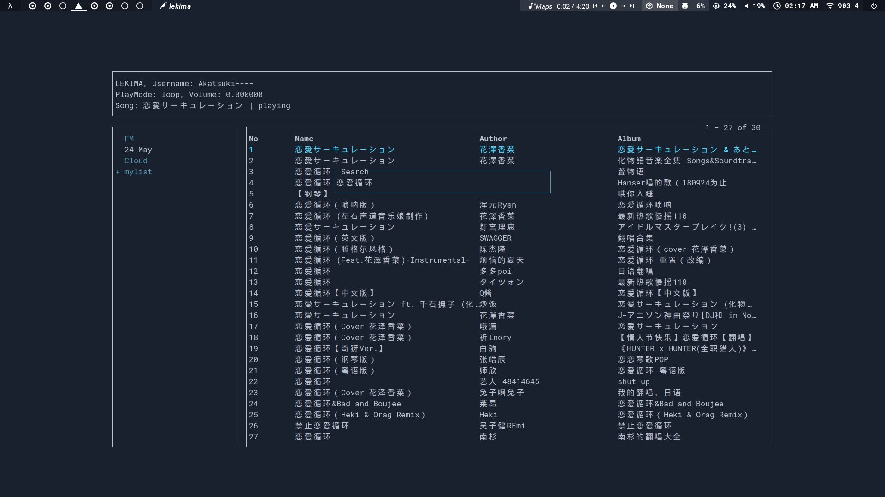

<div align="center">

<center><h1>LEKIMA</h1></center>
<br><br>

Terminal based Netease Cloud Music player for vimer? | vimor?, named after the typhoon lekima.

<br><br>


</div>

## Prerequisites

### Api server

git, node, npm

### Sound
refer to [hajimehoshi/oto](https://github.com/hajimehoshi/oto)


## Installation

**Note**: Tested only on Linux.

```bash
go get github.com/benmooo/lekima
```

## Usage

### Keybinds

  - `q` or `<C-c>`: quit
  - `k`: up
  - `j`: down
  - `g`: jump to top
  - `G` : jump to bottom
  - `<Tab>`: toggle focus 
  - `<Space>`: toggle play 
  - `<Escape>`: go back or terminate current operation
  - `o`: toggle playlists tree | play a music
  - `<Enter>`: toggle playlists tree | play a music | search ..etc.
  - `-`: decrease volume
  - `=`: increase volume
  - `m`: toggle mute
  - `P`: toggle play mode
  - `?`: toggle help

## Many thanks2

- [Binaryify/NeteaseCloudMusicApi](https://github.com/Binaryify/NeteaseCloudMusicApi)
- [gizak/termui](https://github.com/gizak/termui)
  - [nsf/termbox](https://github.com/nsf/termbox-go)
- [faiface/beep](https://github.com/faiface/beep)
  - [hajimehoshi/oto](https://github.com/hajimehoshi/oto)
- [cjbassi/gotop](https://github.com/cjbassi/gotop)
- [golang.org](https://golang.org)

